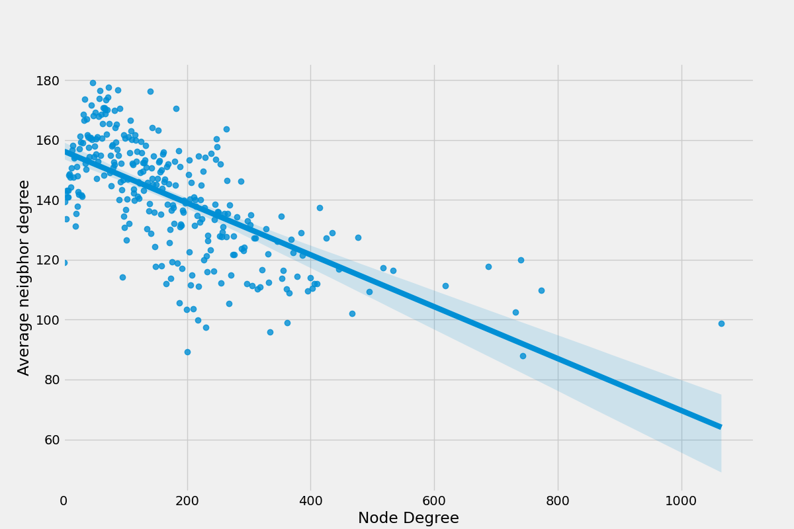
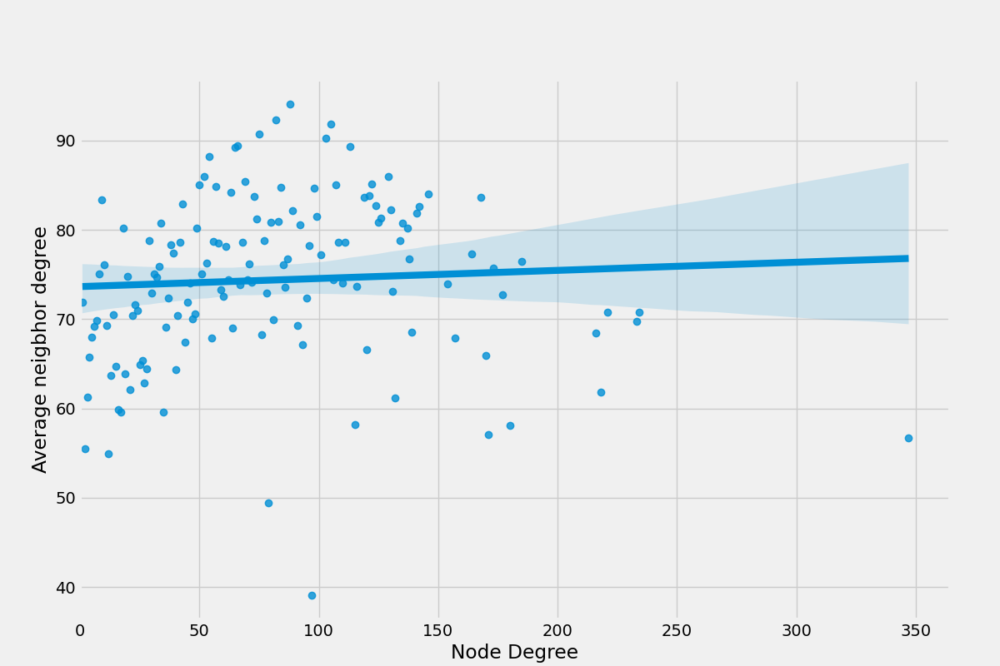
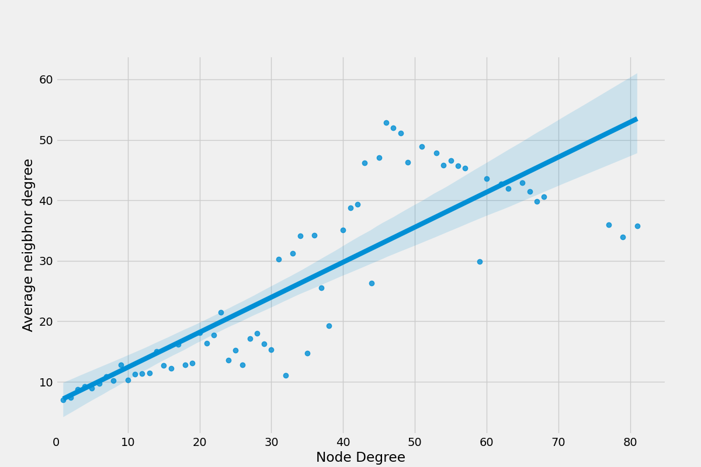

# Análise dos resultados

## Rede: High-energy physics theory citation network

Gráfico decrescente, significando coeficiente de assortatividade negativo, ou seja, nós de grau mais baixo se conectam com nós de grau mais alto. Em resumo, é uma rede dissortativa.

## Rede: Social circles: Twitter

A rede tem grande diversidade de conexões, mostrando uma tendência dissortativa.

## Rede: Wikipedia vote network

Gráfico decrescente, significando coeficiente de assortatividade negativo, ou seja, nós de grau mais baixo se conectam com nós de grau mais alto. Em resumo, é uma rede dissortativa.

## Rede: email-Eu-core network

Coeficiente de assortatividade tende a zero, por o gráfico é aproximadamente constante.

## Rede: General Relativity and Quantum Cosmology collaboration network

Gráfico crescente, significando coeficiente de assortatividade positivo, ou seja, nós de grau mais alto se conectam com nós de grau mais alto. Em resumo, é uma rede assortativa.
